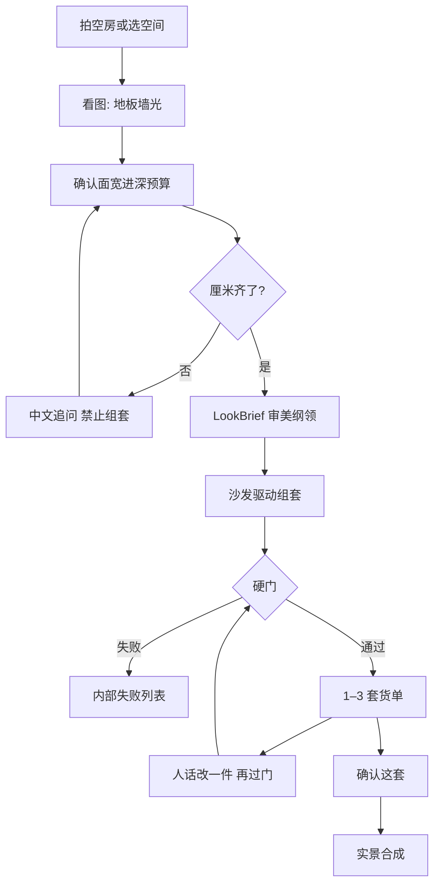
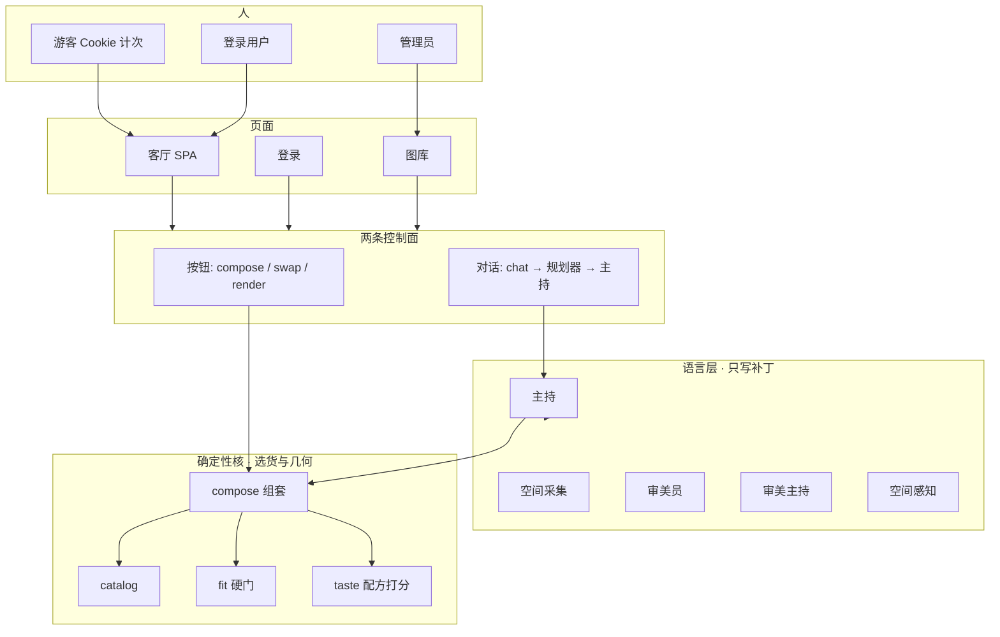
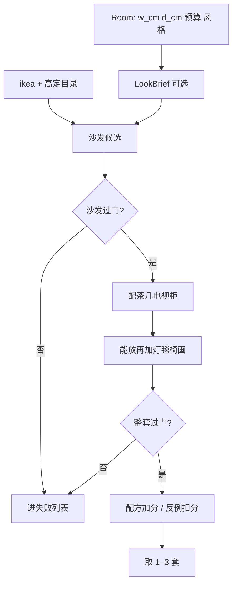
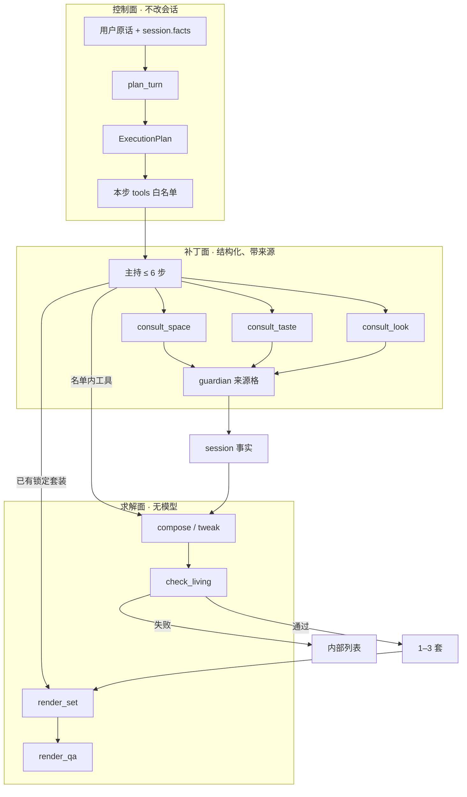
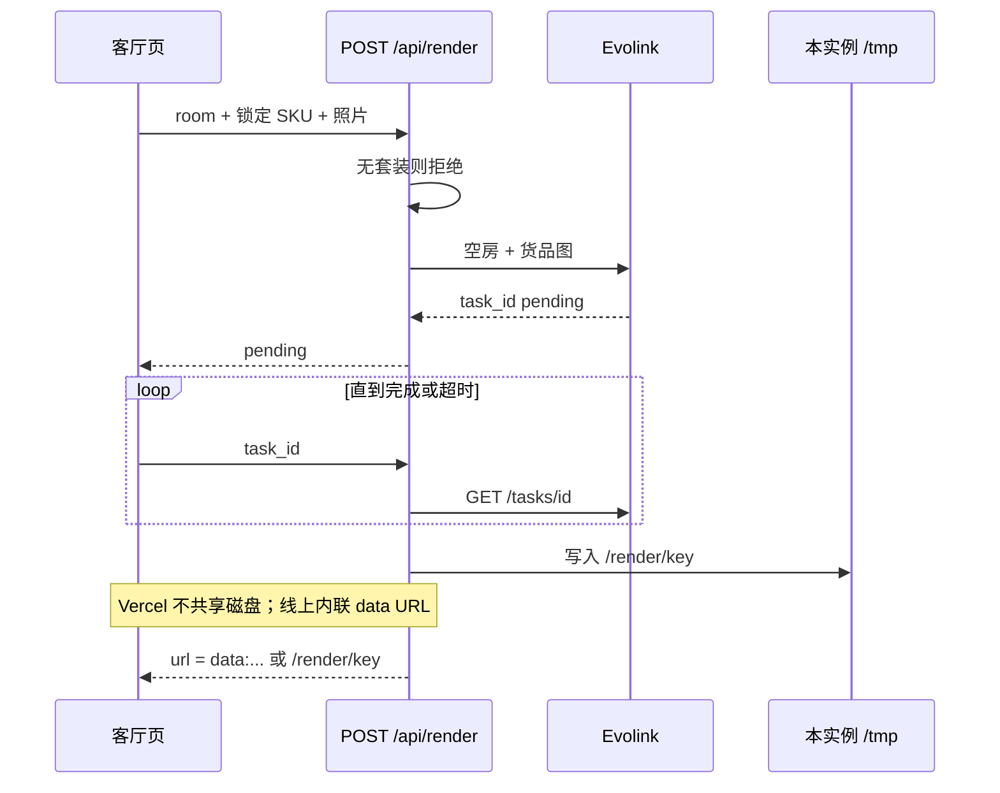

# SPACE 这间客厅

拍一张这间房，先看放不放得下。

按这间房的面宽、进深和预算，从宜家成品目录配出 1–3 套**能买、能放下**的货单；确认这套之后，再合成进这张照片。

**试用：** https://space.ark.flowsome.top

这不是室内效果图生成器。语言模型听懂口味；厘米、货号、走道由确定性代码决定。过不了硬门的沙发不会出现，目录里没有的货也不会被画进房间。

---

## 四步

1. **看这间房** — 照片认地板、墙、光，不当尺子。厘米由用户确认。
2. **先出货单** — 宜家成品，带货号和链接。
3. **硬门** — 两侧 20cm、进深不超过房间 45%、走道 80cm。失败不交给模型去圆。
4. **再合成** — 只把已经锁定的货摆进照片。没有套装，不许出图。



---

## 为什么难

普通人买客厅家具，失败通常不是「不够好看」，而是顺序反了：

1. 先被一张效果图打动，货买不到，或尺寸对不上这间房。
2. 沙发好看，走道没了；衣柜到了，进不了门。
3. 风格靠四个标签猜，「工业混一点原木」对不上货架。
4. 收藏夹里有一堆链接，没有一套能下单的完整货单。

这间客厅把顺序反过来：**空房 → 确认厘米 → 纲领 → 货单过硬门 → 确认后再合成。** 效果图只证明已经锁过的货。没有套装，不许出图。

硬门常数写在代码里，不是写在 prompt 里：沙发两侧各 20cm、沙发进深不超过房间 45%、走道 80cm、不超预算。失败进内部列表，不把「差一点就放下」交给模型去圆。

```python
# 伪代码：硬门。过不了就丢，不交给模型去圆。
SIDE_CM, AISLE_CM, DEPTH_RATIO = 20, 80, 0.45

def check_living(room, kit) -> Fit:
    sofa = kit.sofa
    if sofa.width + 2 * SIDE_CM > room.w_cm:
        return Fail("两侧走道不够 20cm")
    if sofa.depth > room.d_cm * DEPTH_RATIO:
        return Fail("沙发进深超过房间 45%")
    if leftover_aisle(room, kit) < AISLE_CM:
        return Fail("走道不够 80cm")
    if kit.price > room.budget:
        return Fail("超预算")
    return Ok()
```


---

## 系统怎么分层

一个 Python 进程同时出页面和 API（`space_agent/serve.py`）。客厅 SPA、账号、管理员图库都走同一网关。真正的分界不在前后端，而在**语言层**和**确定性核**之间。



| 层 | 允许做什么 | 不允许做什么 |
|---|---|---|
| 语言层 | 从用户话里抽出尺寸/预算/风格；写 LookBrief；调工具；用中文解释失败原因 | 猜厘米、编货号、发明家具、把照片当尺子、声称走道可以少留 |
| 确定性核 | 从宜家 + 高定目录选 SKU；过硬门；配方加分 / 反例扣分；出 1–3 套 | 跳过硬门；把失败套装交给用户 |
| 出图层 | 把**已经锁定**的 SKU 摆进照片 | 没套装就画；画目录里没有的货 |

无 API key 时走 `_rule_host`：同一份计划、同一批工具，不另开一条会编货的捷径。

---

## 1. 看这间房：照片不是尺子

用户拍空房，或先选客厅 / 卧室 / 餐厅等空间底板。

`vision.py` 产出 `SpaceRead`：地板、墙、光。`dim_confidence` 必须是 low——看图可以帮人说话，不能变成面宽进深的事实来源。厘米来自用户确认；采集员没听到的字段必须空，禁止补全。

守门 `guardian.py` 按来源接受补丁，优先级固定：

**用户亲口说的厘米 > 预设 > 看图推断**

厘米不齐，规划器只允许采集，禁止 `compose`。系统用中文追问，而不是先出一套再改。

---

## 2. 审美纲领：先定性，仍不选货

厘米齐了之后，`look.py` 写出 `LookBrief`：风格标签、点题件、要避开什么。组套前出场，过滤目录标签。

审美员可以写 `style / op / slot`，审美主持可以写纲领，两者都不点货号、不写厘米、不发明家具。金标 / 反例目前主要来自 `lookbook.json`；管理员图库已能把室内图做成结构化字段 + 512 维向量进 Supabase，检索接上组套后走同一条 LookBrief，而不是让模型直接从照片里抄一件家具。

完整训练协议、标签八层、入库 / 召回 / 长期记忆见 [风格图知识库 · 训练与向量化](./风格图知识库.md)。核心约束：**照片是教材，向量是目录，配方才是记忆。**

---

## 3. 组套：沙发驱动，失败必丢

求解器不是模型。`compose.py` 从目录里挑沙发候选，先过硬门，再配茶几、电视柜；灯、毯、椅能放再加。整套再过一次门，过了才进入配方打分，取 1–3 套。



```python
# 伪代码：沙发驱动组套。失败进内部列表，不展示给用户。
def compose_living(room, brief, catalog) -> list[Kit]:
    kept, dropped = [], []
    for sofa in catalog.sofas.filter(brief.prefer_tags):
        if check_living(room, Kit(sofa=sofa)).fail:
            dropped.append(sofa); continue
        kit = Kit(sofa=sofa)
        kit += pick(catalog.tables, catalog.tv_benches, room, brief)
        kit += maybe(catalog.lamps, catalog.rugs, catalog.chairs, room, brief)
        if check_living(room, kit).fail:
            dropped.append(kit); continue
        kit.score = recipe_bonus(kit, brief) - anti_pattern(kit)
        kept.append(kit)
    return top(kept, n=3)   # dropped 只给主持解释用
```

每件货有货号和购买链接。目录分宜家可买件和高定询价件。目录里没有的 SKU，后面的合成也不会画。

用户说「沙发再宽一点、灯换金属、预算压到五千」，走换货而不是重画一张图：改一件，再过硬门。过不了就换下一件候选，不把走道让出来。

---

## 4. 两条控制面，一套求解器

客厅按钮和对话栏看起来是两套交互，底层汇合到同一对函数：`compose_living` + `check_living`。语言层不能另开一条会编货的路径。

| 用户动作 | 按钮 API | 对话工具 |
|---|---|---|
| 看图 | — | `/api/see` |
| 出方案 | `POST /api/compose` | `compose_sets` |
| 换一件 | `/api/swap` `/api/replace` | `tweak_set` |
| 效果图 | `POST /api/render` | `render_set` |

---

## Agent 规划设计

不是 ReAct 自由发挥，也不是「一个大模型调一堆工具」。控制面、补丁面、求解面分开：规划器编译意图，专家只写自己能写的字段，求解器才碰货号和几何。



### 规划器是编译器，不是聊天摘要

`plan_turn` 是纯函数：读会话事实和原话，写出 `ExecutionPlan`，**不改 session、不选 SKU、不放松硬门**。每调用完一个工具立刻再规划一次，所以名单会随事实前移——厘米齐了，`collect` 会升成 `compose`；用户要出图但还没有套装，本步是 `compose`，`goal` 记下延后的 `render`。

| action | 本步允许的工具 | 何时出现 |
|---|---|---|
| `collect` | `consult_space` | `session.missing()`，禁止 compose |
| `compose` | `consult_taste?` + `compose_sets` | 厘米齐、要出方案；或要出图但还没有套装 |
| `tweak` | `consult_taste` + `tweak_set` | 已有套装，且用户在改款 |
| `render` | `render_set` | 已有锁定套装，且用户要成图 |
| `explain` / `idle` | 无工具 | 只解释当前货单，或没有新指令 |

主持只能看见 `plan.tools` 里的 JSON schema。点名名单外的工具，运行时返回 `planner_blocked`，这条 tool call 不进求解器。

```python
# 伪代码：意图 → 阶段机；调完一步立刻重编译。
Plan = Literal["collect", "compose", "tweak", "render", "explain", "idle"]

def plan_turn(session, text) -> ExecutionPlan:
    if session.missing():
        return Plan("collect", tools=("consult_space",),
                    goal="render" if wants_render(text) else "compose")
    if wants_render(text) and session.current() is None:
        return Plan("compose", tools=("compose_sets",), goal="render")
    if wants_render(text):
        return Plan("render", tools=("render_set",))
    if session.current() and wants_tweak(text):
        return Plan("tweak", tools=("consult_taste", "tweak_set"))
    if session.current() is None:
        return Plan("compose", tools=("compose_sets",))
    return Plan("explain", tools=())

SOURCE = {"vision": 10, "preset": 20, "user": 40}   # 硬字段只升不降
HARD = {"w_cm", "d_cm", "budget_cny"}

def turn(text, session):
    used = set()
    for _ in range(6):
        plan = plan_turn(session, text)                 # 纯函数
        if plan.action in ("idle", "explain"):
            return reply_in_chinese(session)
        schema = intersect(TOOLS, plan.tools)           # 模型只看见这些
        call = host.choose(schema, session.facts)
        if call.name not in plan.tools:
            return Blocked("planner_blocked")
        patch = SPECIALIST[call.name](text)             # 类型化补丁，不是散文
        session = guardian.commit(session, patch, source=call.source)
        used.add(call.name)
    return ask_for_cm(session)
```

无 API key 时 `_rule_host` 吃**同一份** `ExecutionPlan`、同一批工具，不另开一条会编货的捷径。有模型和没模型，阶段机同构。

### 工种按「能写哪一列」切开

多角色不是为了像 Agent。每个角色有写集和禁区；补丁经 guardian 按来源优先级提交，冲突留痕，不靠 prompt 自觉。

| 角色 | 写集 | 禁区 |
|---|---|---|
| 规划器 | `ExecutionPlan.action` + `tools` | 不改会话、不选货 |
| 主持 | 调工具、用中文引用走道和失败原因 | 不编货号、不改厘米 |
| 空间采集员 | 尺寸 / 预算 / 地板 JSON；没听到的字段必须空 | 猜厘米、点货号 |
| 审美员 | `style` / `op` / `slot` | 点货号 |
| 审美主持 | LookBrief 标签和点题件 | 写厘米、发明家具 |
| 空间感知员 | SpaceRead 地板墙光，`dim_confidence=low` | 照片当尺寸事实 |
| 守门 | 按来源接受或拒绝补丁 | 自己编数字 |
| 求解器 | 目录 SKU + 硬门结论 | 跳过硬门、把失败套装交给用户 |
| 出图 / 质检 | 锁定 SKU 摆进照片 | 没套装就画；用成图回写走道 |

来源格（硬字段）：**用户亲口说的厘米 > 预设 > 看图推断**。看图可以帮人说话，不能覆盖用户已经锁定的面宽进深。

审查可以修一次明显错误，不能把硬门改松。完整模块地图见 [系统流程图](./系统流程图.md)。

---

## 5. 实景合成：锁货之后才画

确认货单后，`render.py` 把空房照片和锁定 SKU 的货品图交给 Evolink，异步出图。前端拿 `pending + task_id` 轮询。没有套装，接口直接拒绝。

```python
# 伪代码：没有锁定货单，不许出图。
def render_set(session, photo):
    if not session.locked_kit:
        return Reject("先确认货单")
    task = evolink.start(room=photo, skus=session.locked_kit.image_urls)
    image = wait(task)
    return inline_data_url(image) if on_vercel else save_tmp(image)
```

成图回来后还有质检 `render_qa`：效果图不是实测，也不能反过来宣称走道可以少留。

线上部署在 Vercel 多实例上，进程内存和 `/tmp` 不共享。因此完成态不能只返回本机 `/render/{key}`——响应里把成图内联为 `data:` URL 或 `image_b64`，客厅页的英雄图才能稳定显示。

游客用本机 Cookie 计次，生图最多 2 次；登录后不限。管理员才能进 `/looks`。



---

## 技术要点（为什么这不是套一层 LLM）

- **阶段机，不是 ReAct**：意图先编译成 `ExecutionPlan`，工具 schema 按步裁剪；调完再规划。延后意图用 `goal` 记住，不跳阶段。
- **三面分离**：控制面不碰货，补丁面不碰几何，求解面不读散文。
- **双控制面同构**：按钮和对话最终进同一套求解器；无模型降级走同一份计划。
- **来源格**：厘米有 provenance 和优先级，冲突留痕，不靠 prompt 自觉。
- **几何与目录在代码里**：硬门常数、SKU、购买链接都不从模型采样。
- **失败不可见但不丢**：过不了门的候选进失败列表，给主持解释用，不展示给用户当「也差不多」。
- **出图是证明，不是决策**：合成发生在锁货之后；质检不能回写尺寸。
- **向量不选货**：金标图变成 LookBrief，求解器仍过硬门；不以图搜 SKU。

---

## 附录

| 文档 | 内容 |
|---|---|
| [系统流程图](./系统流程图.md) | 11 张 Mermaid：Agent、硬门、出图、模块 |
| [风格图知识库](./风格图知识库.md) | 训练协议、标签分层、入库与召回 |
| [产品介绍与 Icon](./产品介绍与Icon设计说明.md) | 品牌边界、色彩、icon brief |
