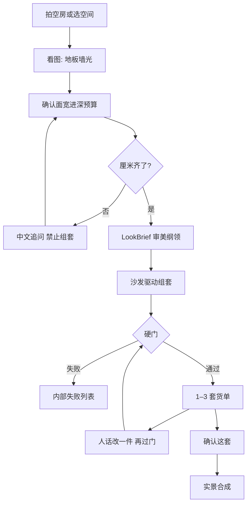

# SPACE 这间客厅

拍一张这间房，先看放不放得下。

按这间房的面宽、进深和预算，从宜家成品目录配出 1–3 套**能买、能放下**的货单；确认这套之后，再合成进这张照片。

**试用：** https://space.ark.flowsome.top

这不是室内效果图生成器。语言模型听懂口味；厘米、货号、走道由确定性代码决定。过不了硬门的沙发不会出现，目录里没有的货也不会被画进房间。

---

## 四步

1. **看这间房** — 照片认地板、墙、光，不当尺子。厘米由用户确认。
2. **先出货单** — 宜家成品，带货号和链接。
3. **硬门** — 两侧 20cm、进深不超过房间 45%、走道 80cm。失败不交给模型去圆。
4. **再合成** — 只把已经锁定的货摆进照片。没有套装，不许出图。

效果图只证明已经锁过的货。

---

## 和套一层 LLM 的差别

- 规划器先锁本轮工具名单，不是模型爱调什么就调什么。
- 按钮和对话汇合到同一套求解器。
- 硬门常数、SKU、购买链接写在代码里，不从模型采样。
- 向量只召回搭配纲领，不以图搜货号。

---

## 继续读

| 文档 | 内容 |
|---|---|
| [架构说明](./架构说明.md) | 完整过程、分层、伪代码 |
| [系统流程图](./系统流程图.md) | 11 张 Mermaid：Agent、硬门、出图、模块 |
| [风格图知识库](./风格图知识库.md) | 训练协议、标签分层、入库与召回 |
| [产品介绍与 Icon](./产品介绍与Icon设计说明.md) | 品牌边界、色彩、icon brief |

本仓库只放说明，不含应用源码、目录和密钥。
