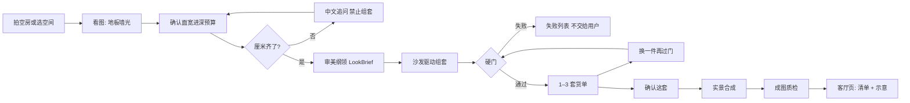
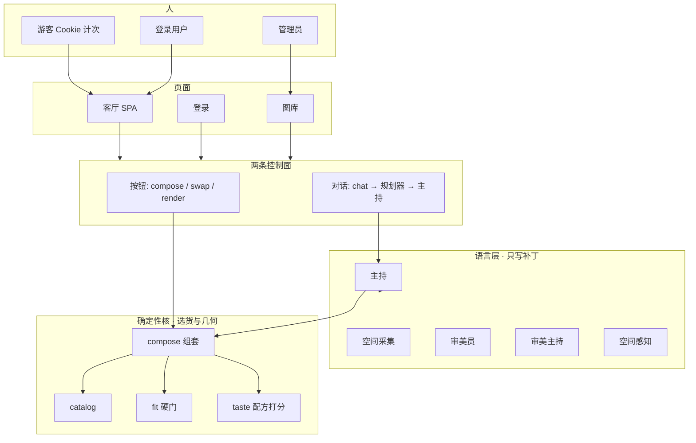
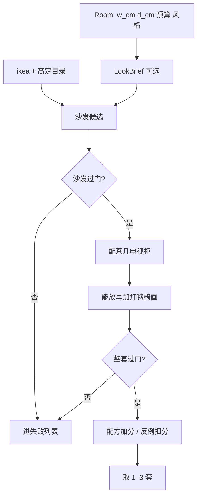
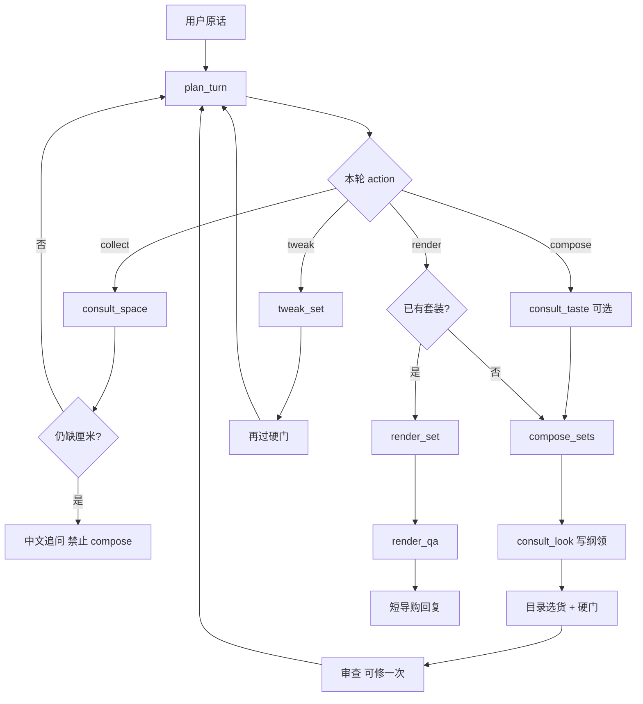
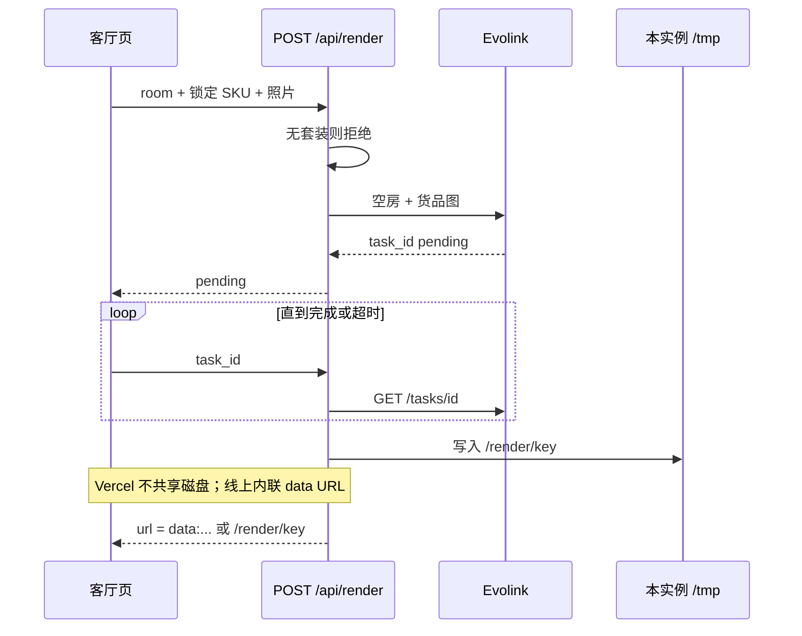

# SPACE 这间客厅

拍一张这间房，先看放不放得下。  
从宜家成品目录配出 1–3 套能买、能放下的货单；确认之后，再把这套货合成进这张照片。

线上：https://space.ark.flowsome.top  
产品代码（私有）：[this-living-room](https://github.com/mengtian-7001/this-living-room)

这不是室内效果图生成器。语言模型听懂口味和改款意图；厘米、货号、走道、预算由确定性代码决定。过不了硬门的沙发不会出现在清单里，目录里没有的货也不会被画进房间。

---

## 为什么难

普通人买客厅家具，失败通常不是「不够好看」，而是顺序反了：

1. 先被一张效果图打动，货买不到，或尺寸对不上这间房。
2. 沙发好看，走道没了；衣柜到了，进不了门。
3. 风格靠四个标签猜，「工业混一点原木」对不上货架。
4. 收藏夹里有一堆链接，没有一套能下单的完整货单。

这间客厅把顺序反过来：

```text
这间空房 → 看图（地板 / 墙 / 光，不当尺子）
         → 用户确认面宽、进深、预算
         → LookBrief 审美纲领（仍不选货）
         → 沙发驱动组套 + 硬门
         → 1–3 套带货号的清单
         → 人话改一件，再过一遍硬门
         → 确认这套
         → 实景合成 + 成图质检
```

效果图只证明已经锁过的货。没有套装，不许出图。

---

## 整条过程（用户看到的）



硬门常数写在 `fit.py`，不是写在 prompt 里：沙发两侧各 20cm、沙发进深不超过房间 45%、走道 80cm、不超预算。失败进内部列表，不把「差一点就放下」交给模型去圆。

---

## 系统怎么分层

一个 Python 进程同时出页面和 API（`space_agent/serve.py`）。客厅 SPA、账号、管理员图库都走同一网关。真正的分界不在前后端，而在**语言层**和**确定性核**之间。



| 层 | 允许做什么 | 不允许做什么 |
|---|---|---|
| 语言层 | 从用户话里抽出尺寸/预算/风格；写 LookBrief；调工具；用中文解释失败原因 | 猜厘米、编货号、发明家具、把照片当尺子、声称走道可以少留 |
| 确定性核 | 从宜家 + 高定目录选 SKU；过硬门；配方加分 / 反例扣分；出 1–3 套 | 跳过硬门；把失败套装交给用户 |
| 出图层 | 把**已经锁定**的 SKU 摆进照片 | 没套装就画；画目录里没有的货 |

无 API key 时走 `_rule_host`：同一份计划、同一批工具，不另开一条会编货的捷径。

---

## 1. 看这间房：照片不是尺子

用户拍空房，或先选客厅 / 卧室 / 餐厅等空间底板。

`vision.py` 产出 `SpaceRead`：地板、墙、光。`dim_confidence` 必须是 low——看图可以帮人说话，不能变成面宽进深的事实来源。厘米来自用户确认；采集员没听到的字段必须空，禁止补全。

守门 `guardian.py` 按来源接受补丁，优先级固定：

**用户亲口说的厘米 > 预设 > 看图推断**

厘米不齐，规划器只允许采集，禁止 `compose`。系统用中文追问，而不是先出一套再改。

---

## 2. 审美纲领：先定性，仍不选货

厘米齐了之后，`look.py` 写出 `LookBrief`：风格标签、点题件、要避开什么。组套前出场，过滤目录标签。

审美员可以写 `style / op / slot`，审美主持可以写纲领，两者都不点货号、不写厘米、不发明家具。金标 / 反例目前主要来自 `lookbook.json`；管理员图库已能把室内图做成结构化字段 + 512 维向量进 Supabase，检索接上组套后走同一条 LookBrief，而不是让模型直接从照片里抄一件家具。

---

## 3. 组套：沙发驱动，失败必丢

求解器不是模型。`compose.py` 从目录里挑沙发候选，先过硬门，再配茶几、电视柜；灯、毯、椅能放再加。整套再过一次门，过了才进入配方打分，取 1–3 套。



每件货有货号和购买链接。目录分宜家可买件和高定询价件。目录里没有的 SKU，后面的合成也不会画。

用户说「沙发再宽一点、灯换金属、预算压到五千」，走换货而不是重画一张图：改一件，再过硬门。过不了就换下一件候选，不把走道让出来。

---

## 4. 两条控制面，一套求解器

客厅按钮和对话栏看起来是两套交互，底层汇合到同一对函数：`compose_living` + `check_living`。

| 用户动作 | 按钮 API | 对话工具 |
|---|---|---|
| 看图 | — | `/api/see` |
| 出方案 | `POST /api/compose` | `compose_sets` |
| 换一件 | `/api/swap` `/api/replace` | `tweak_set` |
| 效果图 | `POST /api/render` | `render_set` |

对话不是「模型爱调什么就调什么」。`plan_turn` 根据缺尺寸、要改款还是要出图，给出**本轮允许的工具名单**。主持 tool loop 最多 6 步；调完一个工具再规划一次。名单外返回 `planner_blocked`。



主持只引用走道和失败原因，不编货号、不改厘米。规划器不改会话、不选货。审查可以修一次明显错误，不能把硬门改松。

---

## 5. 实景合成：锁货之后才画

确认货单后，`render.py` 把空房照片和锁定 SKU 的货品图交给 Evolink，异步出图。前端拿 `pending + task_id` 轮询。没有套装，接口直接拒绝。

成图回来后还有质检 `render_qa`：效果图不是实测，也不能反过来宣称走道可以少留。

线上部署在 Vercel 多实例上，进程内存和 `/tmp` 不共享。因此完成态不能只返回本机 `/render/{key}`——响应里把成图内联为 `data:` URL 或 `image_b64`，客厅页的英雄图才能稳定显示。

游客用本机 Cookie 计次，生图最多 2 次；登录后不限。管理员才能进 `/looks`。



---

## Agent 工种

多角色不是为了「更像 Agent」，是为了把会编造的能力拆开。每个角色有明确可写字段和禁区：

| 角色 | 能写什么 | 铁律 |
|---|---|---|
| 主持 | 调工具、用中文讲走道和失败原因 | 不编货号、不改厘米 |
| 规划器 | 本轮允许的工具名单 | 不改会话、不选货 |
| 空间采集员 | 尺寸 / 预算 / 地板 JSON | 没听到的字段必须空 |
| 审美员 | style / op / slot | 不点货号 |
| 审美主持 | LookBrief 标签和点题件 | 组套前出场，仍不选货 |
| 空间感知员 | SpaceRead 地板墙光 | 照片不当尺寸事实 |
| 守门 | 按来源接受补丁 | 用户厘米优先 |
| 求解器 | 目录 SKU + 硬门结论 | 失败必丢 |
| 出图 | 锁定 SKU 摆进照片 | 没套装不许画 |

完整模块地图、登录额度、部署边界见 [系统流程图](./系统流程图.md)。

---

## 技术要点（为什么这不是套一层 LLM）

- **规划器约束的 tool loop**：本轮白名单 + 调完再规划，而不是 ReAct 自由发挥。
- **双控制面收敛**：按钮和对话最终进同一求解器，避免「UI 一套规则、聊天另一套」。
- **几何与目录在代码里**：硬门常数、SKU、购买链接都不从模型采样。
- **事实有来源优先级**：厘米、风格、看图推断分开写，guardian 合并，而不是揉进一段 prompt。
- **失败不可见但不丢**：过不了门的候选进失败列表，给主持解释用，不展示给用户当「也差不多」。
- **出图是证明，不是决策**：合成发生在锁货之后；无套装拒绝；质检不能回写尺寸。
- **无模型降级路径与有模型路径同构**：避免本地调试时走会幻觉的捷径。

---

## 本仓库还有什么

| 文档 | 给谁 |
|---|---|
| [产品介绍与 Icon 设计说明](./产品介绍与Icon设计说明.md) | 品牌、设计、对外物料：产品边界、色彩、icon brief |
| [系统流程图](./系统流程图.md) | 工程备份：11 张图 + 模块路径，对照代码日期写在文首 |

本仓库不含应用源码、目录 JSON、密钥、缓存。要跑产品，去代码仓按那边的 README 启动。
