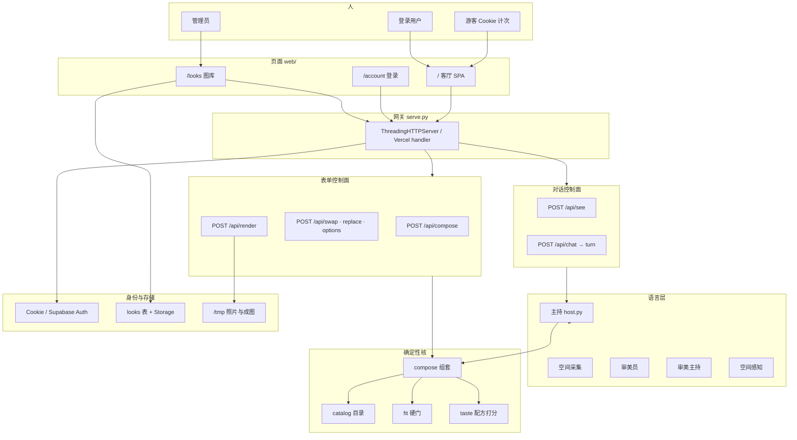
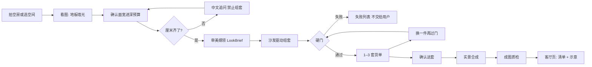
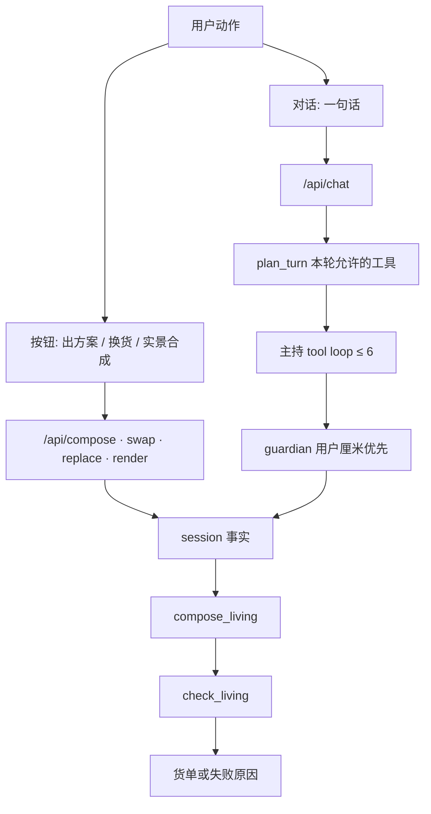
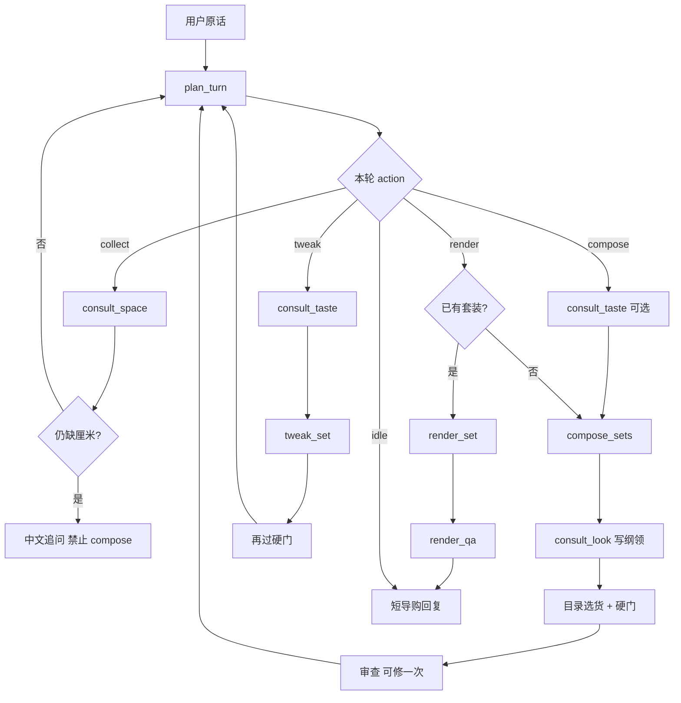
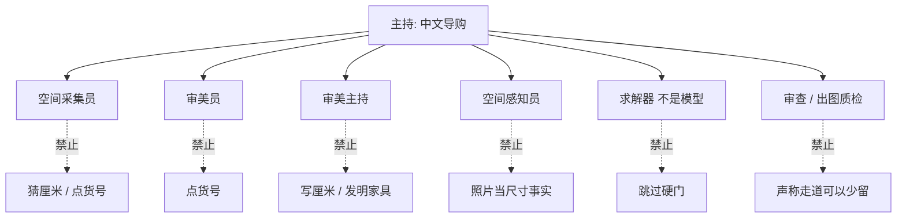
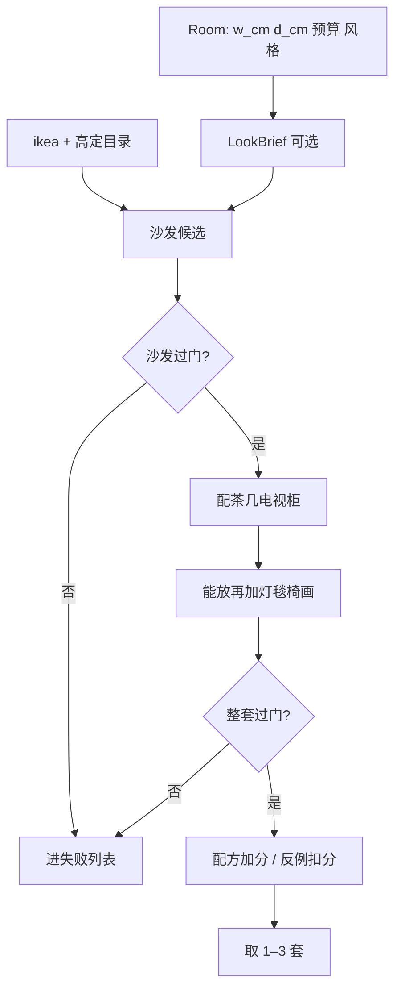
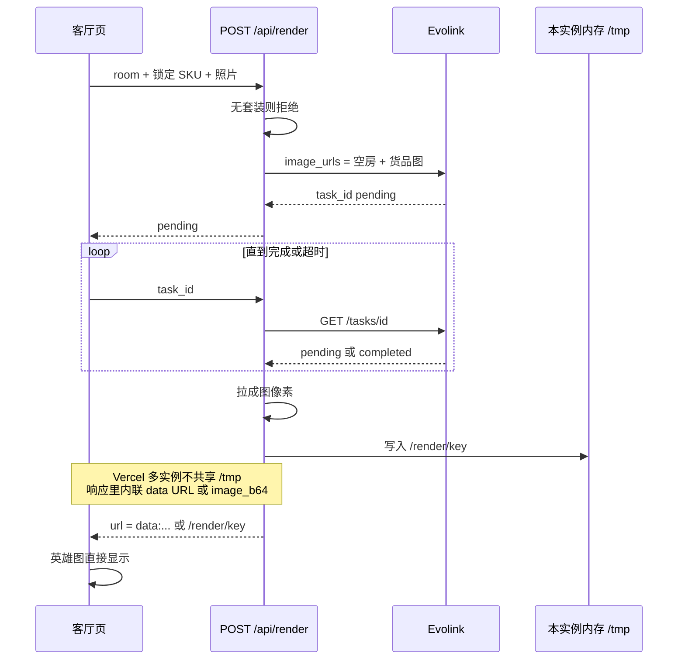
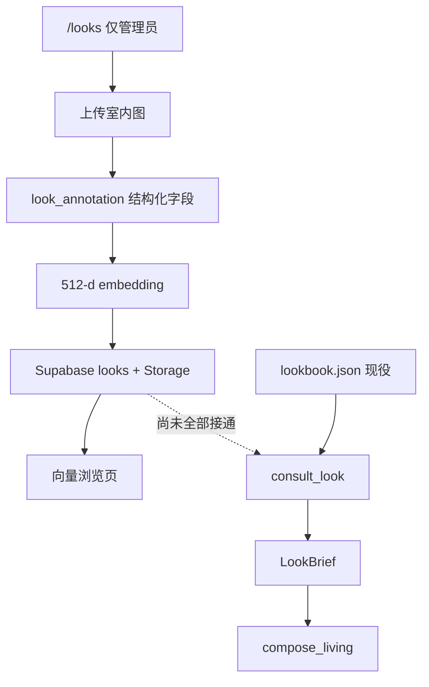
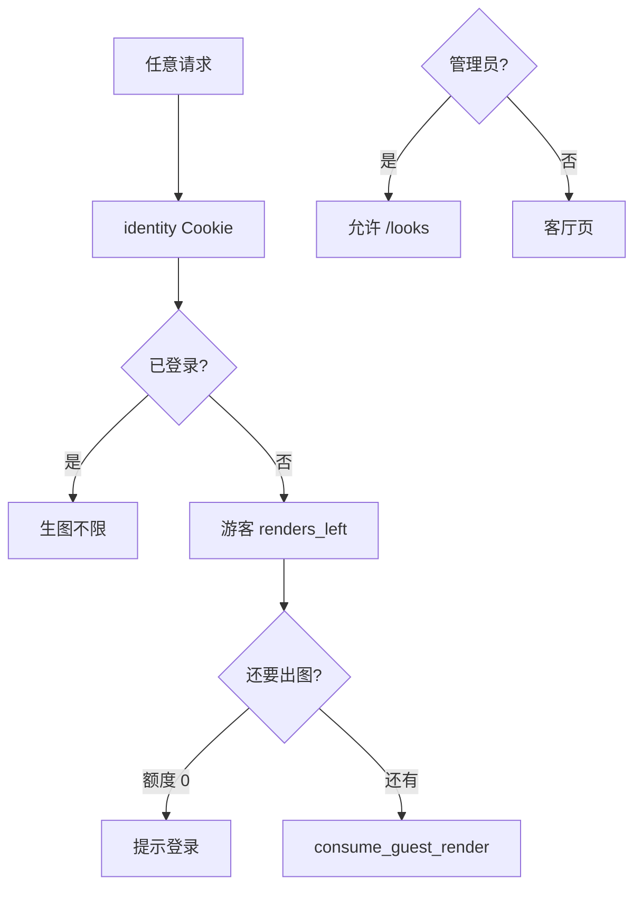
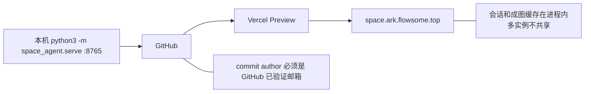

# 这间客厅 · 系统流程图

这份图放在介绍仓库里备份。Cursor 旁路画布不进 Git。还原架构说明以本文为准。

对照代码日期：2026-09-02。入口是 `space_agent/serve.py`。

---

## 1. 分层总览

一个 Python 进程同时出页面和 API。语言模型只写补丁；厘米、货号、几何由确定性代码决定。

---

## 2. 用户主链路

空房 → 尺寸 → 货单 → 硬门 → 确认 → 合成。效果图只证明已经锁过的货。

硬门常数（`fit.py`）：沙发两侧各 20cm、沙发进深 ≤ 房间 45%、走道 80cm、不超预算。

---

## 3. 两条控制面、一套求解器

客厅按钮走表单 API，对话栏走主持。两边最后都进 `compose_living` 和 `check_living`。

| 动作 | 表单 | 对话工具 |
|---|---|---|
| 看图 | — | `/api/see` |
| 出方案 | `/api/compose` | `compose_sets` |
| 换一件 | `/api/swap` `/api/replace` | `tweak_set` |
| 效果图 | `/api/render` | `render_set` |

---

## 4. 主持一轮：规划器先锁工具

不是模型爱调什么就调什么。`plan_turn` 看缺尺寸、要改款还是要出图，给出本轮名单。调完一个工具再规划一次。名单外返回 `planner_blocked`。

无 API key 时 `_rule_host` 按**同一份计划**走同一批工具，不另开会编货的路径。

---

## 5. Agent 工种与禁区

| 角色 | 文件 | 能写什么 | 铁律 |
|---|---|---|---|
| 主持 | `host.py` | 调工具、引用走道和失败原因 | 不编货号、不改厘米 |
| 规划器 | `execution.py` | 本轮允许的工具 | 不改会话、不选货 |
| 采集员 | `specialists.py` | 尺寸 / 预算 / 地板 JSON | 没听到的字段必须空 |
| 审美员 | `specialists.py` | style / op / slot | 不点货号 |
| 审美主持 | `look.py` | LookBrief 标签和点题件 | 组套前出场，仍不选货 |
| 感知员 | `vision.py` | SpaceRead 地板墙光 | `dim_confidence` 必须 low |
| 守门 | `guardian.py` | 按来源接受补丁 | 用户厘米 > 预设 > 看图 |
| 求解器 | `compose.py` `fit.py` | 目录 SKU + 硬门结论 | 失败必丢 |
| 出图 | `render.py` | 锁定 SKU 摆进照片 | 没套装不许画 |

---

## 6. 组套与硬门

沙发先过门，再配茶几、电视柜；灯毯椅能放再加。

---

## 7. 实景合成（含线上注意）

确认货单之后才出图。Evolink 异步：先 `pending + task_id`，前端轮询。

游客本机 Cookie 计次，生图最多 2 次；登录后不限。

---

## 8. 图库与审美知识

管理员上传 gold / avoid 图。向量已能入库；组套仍主要读 `lookbook.json`。检索接上后走虚线。

入库字段：`space`（地板/墙/光）、`objects`（槽 + 词表标签）、`pairings`、`principle`。采集员不从图库学厘米。

---

## 9. 登录与额度

---

## 10. 部署与备份边界

备份时不要提交：`.env`、`.vercel`、`data/cache/`、密钥。本文和 `web/` `space_agent/` `data/catalog/` `data/taste/` 才是可还原的产品。

---

## 11. 模块地图

| 层 | 路径 | 现在做什么 |
|---|---|---|
| 客厅 | `web/index.html` `app.js` | 拍照、填尺寸、组套、换款、出图 |
| 账号 | `web/account.html` | 登录注册；管理员再进图库 |
| 图库 | `web/looks.html` | gold/avoid 图 + 向量浏览 |
| 网关 | `space_agent/serve.py` | 全部 HTTP 路由 |
| 主持 | `agent/host.py` | 规划器约束下的工具循环 |
| 看图 | `agent/vision.py` | 地板墙光，不当尺寸 |
| 纲领 | `agent/look.py` | LookBrief → 求解器过滤标签 |
| 组套 | `compose.py` `fit.py` | 沙发驱动 + 硬门 |
| 出图 | `agent/render.py` | 锁定 SKU；线上内联成图 |
| 目录 | `catalog.py` | 宜家可买件 + 高定询价件 |
| 图库后端 | `taste_looks.py` `supabase_looks.py` | 磁盘或 Supabase |
