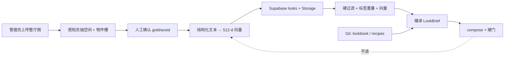
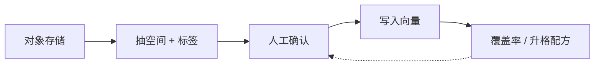
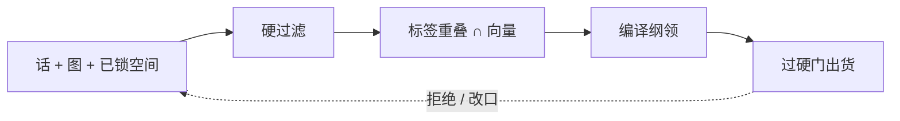

# 风格图知识库 · 训练与向量化

这份说明来自「这间客厅」的审美训练稿：怎么用照片教会求解器，而不是用照片直接出货。原先只在本机画布里，现在放进介绍仓库，和产品链路一起公开。

一句话：

> 照片是教材，封闭标签是求解器能吃的语言，编译出来的配方才是长期记忆。向量只当教材目录。

不要做「把照片丢进向量库，近邻房间里的沙发当答案」。CLIP 分不清橡木和胡桃；近邻图里的货未必能买，也过不了走道硬门。

---

## 它在产品里干什么

组套前，审美主持写出 `LookBrief`（prefer / avoid / pairings / 点题件）。图库的任务是：**用确认过的 gold / avoid 图，把这份纲领写得更准**。货号仍然只来自目录，厘米仍然不从图里来。



管理员页面在产品里叫 **视觉向量库**（`/looks`）。C 端客厅页不直接搜图。

---

## 三套不该混的库

| 库 | 装什么 | 怎么查 | 谁写 |
|---|---|---|---|
| **looks** 风格范例 | 确认过的 gold / avoid 整厅图 + 封闭标签 + 原则 | 硬过滤 + 标签重叠 + 向量 | 人确认后才进索引 |
| **rooms** 用户空房 | 业主照片 + 地板 / 墙 / 光 | 按人按场次取，**不进风格近邻** | 用户拍照自动写 |
| **events** 口味事件 | 采纳 / 拒绝、改标签、「更工业一点」 | 按用户聚合成权重，不按图搜 | 面谈和线上会话回写 |

把业主空房和金标客厅放进同一个近邻索引，系统会把「这间房长什么样」误当成「该买什么风格」。

词表、配方、反例继续放 Git（`data/taste/*.json`）。品味要能 diff、能回滚，不跟某一版 embedding 绑死。

---

## 一张训练图必须长什么样

入库时读一次像素，抽出求解器已经在用的字段。之后检索和组套只吃这些字段，三个 agent 不必每轮再「看」历史照片。

```text
verdict:   gold | avoid
space:     floor_tone / wall_tone / light     ← 感知员字段
objects:   [{ slot: sofa, tags: [oatmeal, box] }]  ← lookbook 词表，不自由发挥
pairings:  [{ if: 浅沙发, then: 深木台 }]
principle: 浅沙发需要深台压住
embedding: 由上面这段结构化文本生成
```

开放中文标签（「中古」「法式奶油」）可以给人看，**进组套的必须映射到已有词表**（`oatmeal`、`walnut`、`skirted`、`industrial`）。对不上的只作展示。采集员不要从金标图里学面宽进深——好看图里的房间和用户这间房不是同一间。

缺判决、缺原则、只有「好看」的图，可以进草稿，不准进召回索引。

---

## 标签八层（一层一个职责）

完整风格标签不是把风格词堆多。求解器只能吃和 `sku_tags` 同一套英文词表。

| 层 | 字段 | 封闭？ | 用途 |
|---|---|---|---|
| 0 身份 | id, sha1, blob_url, added_at | 是 | 去重、CDN、审计 |
| 1 判决 | verdict=gold\|avoid, principle_id | 是 | 召回前硬过滤；avoid 只做负向重排 |
| 2 空间 | room_kind, floor_tone, wall_tone, light | 是 | 和空房事实对齐；不是风格 |
| 3 家族 | mix[]：极简 / 古典 / 原木 / 工业 / 冷灰 | 多标签 | 允许混搭；禁止再做成四选一 |
| 4 感知 | color / material / silhouette / visual_weight | 是 | 必须能映射到货品标签 |
| 5 构图 | slots_present, anchors, spotlight, avoid_on | 是 | 编译 LookBrief.program |
| 6 句子 | note, intent, caption | 半开放 | 给人看、给文本向量用 |
| 7 向量 | embedding, model_id, dim | 模型锁定 | 软相似；换模型必须整库重嵌 |
| 8 隔离 | free_tags[] | 开放 | 先关这里，出现 ≥5 次再升格进词表 |

沿用现有封闭词表（`lookbook.json` 的 vocab）：

| 轴 | 例子 |
|---|---|
| color | oatmeal cream beige charcoal gray white black walnut oak pine |
| material | fabric linen leather wood metal steel chrome glass rattan high_gloss |
| silhouette | box skirted deep_seat wingback legged industrial stem long_low |
| weight | light medium heavy |
| slots | sofa / coffee_table / tv_bench / lamp / rug / armchair / art |

不要把「轻奢」「奶油风」做成第五个死风格——别名映射到家族即可。

---

## 怎么教（训练协议）

图是标准，JSON 是记忆。模型不记住品味。

一次有效示范：

| 步骤 | 你给什么 | 写进哪里 |
|---|---|---|
| 1 | 客厅整景，能看见沙发 + 几 + 毯 + 灯 | 先列看到的 color / material / silhouette |
| 2 | 标明 gold 或 avoid | gold → 正例原则；avoid → 反例 |
| 3 | 纠正标错的标签（那不是胡桃是橡木） | 词表或 sku_tags，不绑正在变动的货号 |
| 4 | 同一原则 3–8 张就停 | 下一批换一条原则，避免配方互相打架 |

不要拿来当标准的图：

- 单件白底商品图：只能教标签，不能教搭配。
- 效果图里有目录没有的家具：那是幻想，写不进求解器。
- 一次丢 30 张无说明的图：系统会猜错你在乎哪一条。

好标签 vs 空标签：

| 差的说法 | 好的标签 | 为什么 |
|---|---|---|
| 高级感、轻奢、氛围感 | oatmeal + walnut + skirted + heavy | 求解器只能匹配词，不能匹配形容词 |
| 好看、高级灰 | charcoal sofa → black/steel table | 写成如果-那么，组套才能打分 |
| 不要太乱 | forbid: high_gloss + white table with white tv | 反例必须点名槽位和标签 |
| 工业风一点 | style=工业, lamp=industrial, rug≠oatmeal | 风格是入口，槽位规则才是味道 |

每个 gold 原则至少 3 张整厅，每个 avoid 原则至少 2 张。三十张乱图不如十二张写对原则的图。一批只教一条。

---

## 入库



虚线：聚类之后可以提议新配方，仍要人点头才写进 Git 里的 `recipes.json`。

| 位置 | 内容 | 为什么 |
|---|---|---|
| Supabase Storage | 原图 + 长边约 1280 预览 | Vercel 函数不落盘 |
| Postgres `looks` | 结构化字段 JSONB + principle + confirmed_at | 硬过滤、覆盖率、RLS |
| pgvector | 512 维，带 model_id | 只索引已确认的 gold/avoid |
| Git JSON | vocab、recipes、anti_patterns | 品味是代码 |
| events | 采纳 / 拒绝、改标签 | 长期记忆，不是又一套图库 |

室内材质上 CLIP 很弱，所以**向量是辅、封闭标签是主**。embedding 用结构化文本（空间 + 槽位标签 + 原则），不要用浏览器 16×16 缩略图。同一列禁止混两个模型的向量；换模型就离线重嵌，表里留下 `model_id`。确认后才 embed，未确认的图不准进召回。

已有照片的批处理：sha1 去重 → 抽空间和槽 → 填判决和原则 → `/looks` 队列只出未确认 → 确认后 embed → `coverage()` 盯原则缺口。先补原则洞，再追求张数。

---

## 召回：出口必须是 LookBrief



求解器仍然不读向量。向量只帮助挑出「像哪类对的客厅」，货仍由 `compose` 从目录里出。

```python
# 伪代码：召回编译纲领，不召回货号。
def consult_look(style, space, query_text) -> LookBrief:
    q = embed(fields_to_text(style, space, query_text))   # 结构化文本，不是缩略图
    pool = looks.where(confirmed=True, verdict="gold")
    pool = hard_filter(pool, room_kind=space.kind, clash_table=MIX_CLASH)
    ranked = hybrid(
        tag_overlap(pool, vocab_tags(query_text)),         # 权重大于余弦
        cosine(pool.embedding, q, k=20),
    )
    avoid = looks.where(verdict="avoid").principles_hit_by(ranked)
    brief = LookBrief.from_neighbors(top(ranked, 3), avoid)
    # brief.prefer_tags / avoid / pairings —— 仍然没有 sku
    return brief
```

| 步 | 输入 | 做法 |
|---|---|---|
| 查询 | 用户原话 + 空房空间事实 | 文本向量用结构化句；用户房不当风格近邻 |
| 硬过滤 | gold、room_kind、混搭冲突 | 古典×工业 keep_first；avoid 不进正例 TopK |
| 标签分 | mix 与 color/material/silhouette 重叠 | 和 sku_tags 同一词表，**权重大于余弦** |
| 向量分 | 范例 embedding | k=20，只在过滤后的子集上算 |
| 融合 | 标签为主、向量为辅 | 防止橡木 / 胡桃互窜 |
| 重排 | 原则覆盖、用户曾经拒绝的标签 | 拒绝过 skirted，直接降权 |
| 编译 | Top gold + 命中的 avoid | 并集成 LookBrief，交给现有 compose |

三层记忆不要揉成一段聊天记录：

| 范围 | 是什么 |
|---|---|
| 全局 | 确认过的 looks：公司品味，面谈和线上共用 |
| 每人 | 从 events 滚出来的加权 prefer/avoid；冷启动用全局，有约 3 次采纳后掺用户权重 |
| 当次 | `AgentSession.look`：只记这间房当前纲领 |

不要把会话消息整段向量化当长期记忆。

---

## 长期记忆怎么长

| 事件 | 写到哪 | 何时升格成配方 |
|---|---|---|
| 入库并确认一张 gold | looks + 向量 | 不升格，只增加教材 |
| 用户说更工业一点 | session.look + events | 单次改口不够 |
| 采纳一套货 | events accepted_tags | 同用户重复 3 次同类，写入 user_taste |
| 拒绝 / 点 avoid | events avoid_tags | 立即进入该用户重排 |
| 人工改标签 | looks 修正 + 重嵌 | 词表若新增，先改 Git vocab |
| 同簇 gold ≥5 且原则还没有 | draft_recipe | **人确认后**才写 recipes.json |

---

## 部署：不要新开一套向量云

落在已经在用的 Supabase 项目里。Vercel 只跑接口，不存图。

| 层 | 落点 | 理由 |
|---|---|---|
| 计算 | 继续 Vercel：`space_agent/serve.py` | 读写知识库的 API 跟组套同一进程 |
| 图 + 表 + 向量 | 现有 Supabase：Storage + Postgres + pgvector | 登录、RLS、范例图同一套身份 |
| 配方 / 词表 | Git → `data/taste/*.json` | 求解器启动读仓库，不读向量库 |
| 用户空房 | 同一项目的 rooms 前缀 | 和 looks 分开，空房不进风格近邻 |

不上 Pinecone / Weaviate / 独立 RAG 平台。不上第二套 Postgres。图的浏览靠 HTTPS 地址，不靠 Python 从磁盘读——线上 `/tmp` 请求一结束文件就没了。

---

## 代码里现在走到哪

对照产品实现（会随版本更新）：

| 能力 | 状态 |
|---|---|
| `/looks` 管理员上传、gold/avoid、结构化标注 | 已有 |
| 感知员按地板/墙/光、物件槽、pairing、原则标注 | 已有（`look_annotation.py`） |
| embedding 用结构化文本，512 维进 Supabase | 已有 |
| `consult_look` 按风格/标签/地板找邻居，写进 LookBrief | 已接；无库时回退 `lookbook.json` |
| 共现计数编译进 `recipes.json` | 尚未自动做，仍靠人写 Git |
| events → 每人长期口味档案 | 设计有，产品侧尚未作为主路径 |

验收不看张数，看这三个：

1. 每个 gold 原则 ≥ 3 张已确认。
2. 「工业混原木」召回的 Brief 里避免出现 skirted。
3. 用户拒绝米黄后，同用户下一次 prefer 不再含 oatmeal。

---

## 和主链路的关系

产品首页见 [README](./README.md)，完整走读见 [架构说明](./架构说明.md)。图库在那条链路上只出现一次：厘米齐了之后、求解器选货之前。它改的是纲领，不改厘米，不点货号。
